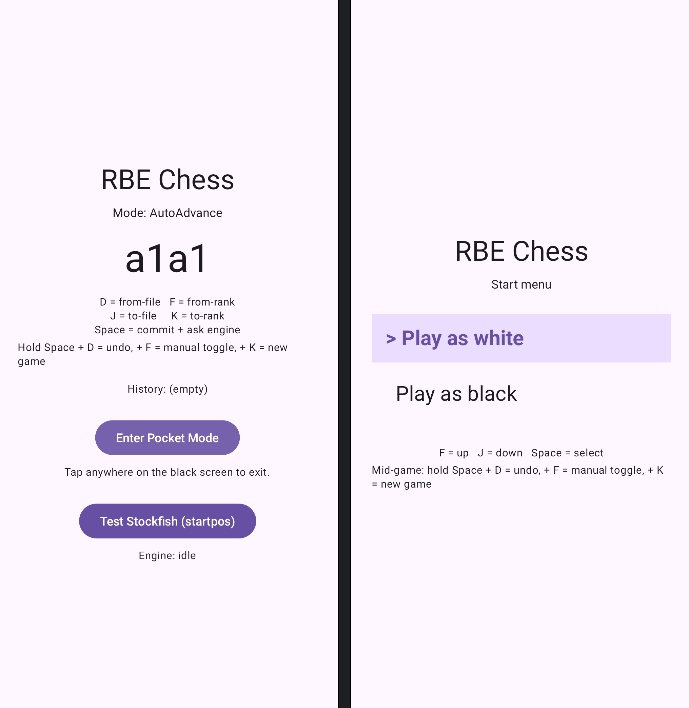
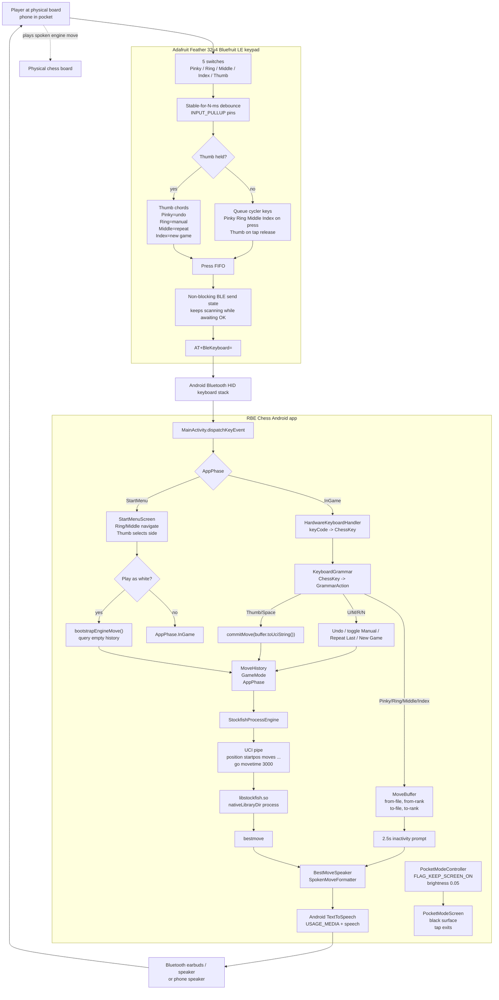
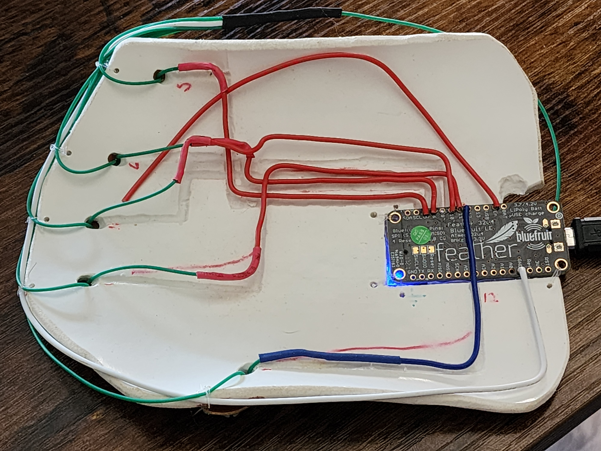
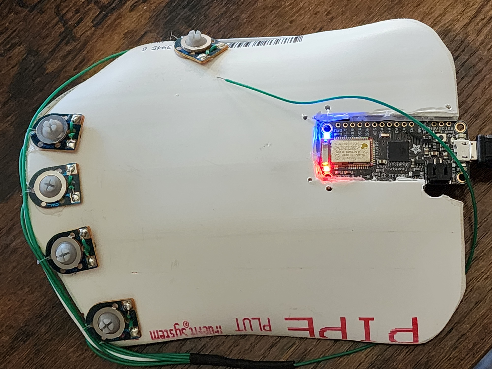

# RBE Chess

**RBE Chess** is a local-first Android chess assistant for playing at a
physical board with the phone in a pocket. A custom 5-button Bluetooth
HID keypad enters moves, the app asks bundled Stockfish for a reply, and
Android Text-to-Speech speaks the move through the current audio route.

The current build is centered on **Pocket Mode**: the Activity stays in
the foreground with a black, dim screen so Android keeps delivering
Bluetooth keyboard events. True screen-off / locked-screen input is a
later experiment, not the main path.

<p align="center">
  
</p>

## Pocket-Mode Control Flow



## How The Loop Feels

1. Pair the keypad; Android sees it as a hardware keyboard named
   `RBE Keypad v<N>`.
2. Launch RBE Chess. The verbal start menu speaks the current option.
3. Use **Ring/Middle** to choose a side and **Thumb** to start.
4. Enter the opponent's move with the four cycler buttons.
5. Tap **Thumb**. The app says "Calculating", sends the move history to
   Stockfish, then speaks the best move.
6. In AutoAdvance mode, the spoken engine move is appended to history so
   the next keypad move is again the opponent's reply. In Manual mode,
   the engine move is only advisory and the user types every ply.

## Keypad Controls

### In Game

| Gesture                    | Firmware HID output | Android action                                |
| -------------------------- | -------------------:| --------------------------------------------- |
| **Pinky**                  | `D`                 | Cycle from-file: `a` through `h`              |
| **Ring**                   | `F`                 | Cycle from-rank: `1` through `8`              |
| **Middle**                 | `J`                 | Cycle to-file: `a` through `h`                |
| **Index**                  | `K`                 | Cycle to-rank: `1` through `8`                |
| **Thumb tap**              | `Space`             | Commit the current UCI move and ask Stockfish |
| **Hold Thumb + Pinky**     | `U`                 | Undo the last move pair and clear the buffer  |
| **Hold Thumb + Ring**      | `M`                 | Toggle Manual / AutoAdvance mode              |
| **Hold Thumb + Middle**    | `R`                 | Repeat the last replayable spoken output      |
| **Hold Thumb + Index**     | `N`                 | New game; return to the start menu            |

Each coordinate starts unset and renders as `a` or `1`. The first press
selects the first value, so one Pinky press speaks `A`, two Pinky presses
speak `B`, and so on. After 2.5 seconds of no keypresses, TTS reads the
assembled move as a confirmation prompt.

### Start Menu

| Gesture                         | Action          |
| ------------------------------- | --------------- |
| **Ring**                        | Previous option |
| **Middle**                      | Next option     |
| **Thumb**                       | Select side     |
| **Hold Thumb + Middle**         | Repeat last spoken option/status |
| **Pinky / Index / other chords**| Ignored         |

## Hardware Prototype

A carved and warped piece of split pvc pipe, heat-formed to hug my thigh while resting in my pocket. buttons are pressable through jeans/pants. Battery fits into notch, no switch yet (will be wired between ground and enable)

| Bottom view                                               | Top view                                                   |
| --------------------------------------------------------- | ---------------------------------------------------------- |
|  |  |

The current keypad firmware lives in
[`firmware/RBE_32u4_chess`](firmware/RBE_32u4_chess). It targets an
**Adafruit Feather 32u4 Bluefruit LE** with five momentary switches wired
from pin to ground using internal pull-ups:

| Finger | Firmware HID | Feather pin |
| ------ | ------------ | -----------:|
| Pinky  | `D`          | 5           |
| Ring   | `F`          | 6           |
| Middle | `J`          | 10          |
| Index  | `K`          | 11          |
| Thumb  | `Space`      | 12          |

Firmware blinks `FIRMWARE_VERSION` on boot and advertises as
`RBE Keypad v<N>`, making it possible to confirm which sketch is flashed
without a USB serial session. (Current version is 7.)

Battery is sampled from the A9 voltage divider, converted to a 0–100 %
piecewise-linear Li-Po estimate, and pushed once per minute as four HID
keystrokes — the literal characters `B` + three zero-padded ASCII
digits (e.g. `B025`). The app's `BatteryReportParser` intercepts the
sequence before the chess grammar sees it, so the keystream stays
clean. See the firmware README's "Battery reporting via the HID stream"
section.

## Android Architecture

The app is intentionally small and Activity-owned for the M1/M2 pocket
loop:

| Area          | Files                                    | Responsibility                                                              |
| ------------- | ---------------------------------------- | --------------------------------------------------------------------------- |
| App shell     | `MainActivity.kt`, `ui/`                 | Start menu, normal screen, Pocket Mode entry, key dispatch                  |
| Input grammar | `input/`                                 | Map Android `KeyEvent`s to chess actions and mutate `MoveBuffer`            |
| Game state    | `chess/MoveHistory.kt`, `ui/AppPhase.kt` | Track UCI plies, side selection, AutoAdvance vs Manual                      |
| Pocket Mode   | `pocket/`                                | Keep the Activity awake, dim the screen, show the black tap-to-exit surface |
| Engine        | `engine/`                                | Spawn Stockfish and speak UCI over stdin/stdout                             |
| Speech        | `speech/`                                | Convert UCI moves and status events into TTS-friendly phrases               |

Stockfish is treated as a black-box process. The Android code does not
implement chess search; it sends `position startpos moves ...` and
`go movetime 3000`, then waits for `bestmove`.

## Stockfish Binary

The actual engine binary is not committed because it is about 109 MB.
After cloning, fetch it once:

```bash
scripts/fetch-stockfish.sh
```

The script places the official Stockfish `sf_18` Android ARMv8 Dot
Product build at:

```text
app/src/main/jniLibs/arm64-v8a/libstockfish.so
```

The `.so` name is an Android packaging trick: AGP extracts `lib*.so`
files into `nativeLibraryDir`, where `StockfishProcessEngine` can
execute the file directly and talk UCI to it.

## Build

Prerequisites:

- Android SDK 35
- JDK 11-compatible Android toolchain
- Gradle wrapper from this repo
- Arduino IDE or `arduino-cli` for the Feather firmware

Common app commands:

```powershell
# Run JVM unit tests
.\gradlew.bat test

# Build a debug APK
.\gradlew.bat assembleDebug

# Install on a connected Android device
.\gradlew.bat installDebug
```

Wireless debugging over Wi-Fi is supported and preferred for app
dogfooding on the S22 Ultra. Use USB mainly for initial pairing,
recovery, or firmware work. On the phone, enable **Developer options →
Wireless debugging**, then pair/connect from the workstation:

```powershell
adb pair <phone-ip>:<pairing-port>
adb connect <phone-ip>:<debug-port>
.\gradlew.bat installDebug
```

The pairing port and debug port are usually different; Android shows
both in the Wireless debugging screen. Keep the phone and workstation on
the same trusted Wi-Fi network.

Firmware build notes and upload troubleshooting are in
[`firmware/RBE_32u4_chess/README.md`](firmware/RBE_32u4_chess/README.md).

## Current Status

- Pocket Mode black screen, brightness dimming, and Activity-scoped
  keyboard capture are implemented.
- Firmware v7: finger-labeled cycler keys, Thumb-as-modifier chords
  (Pinky/Ring/Middle/Index emit `U`/`M`/`R`/`N` HID), and battery reports via the HID stream
  (`B` + 3 zero-padded ASCII digits, once per minute). The app
  parses the reports out of the keystream and shows
  `Keypad battery: NN%` on the normal screen; TTS warns below 20 %
  / 5 % with hysteresis above 30 %.
  Adjacent duplicate keypresses are split across BLE commands so rapid
  repeated taps count without being treated as a held key by Android.
- Keypad-entered moves are checked against Stockfish legal moves before
  they enter history. Illegal moves leave the current buffer intact and
  TTS says "Illegal move."
- M2 chord paths + start menu + manual toggle + undo + new game are
  hardware-confirmed. Battery reporting is hardware-confirmed.
- **Remaining hardware gap**: full-game loop (multiple commit cycles
  in a row) has not been exercised end-to-end. Single commits are
  JVM-green and the M2 control paths around them work; nobody has
  played a real game through the loop yet. Tracked in
  [`STATUS.md`](STATUS.md).
- Promotion input and true screen-off/background keyboard capture are
  deferred. The standard BLE Battery Service path (Android Settings
  battery %) is also deferred — this nRF51 module's AT firmware
  doesn't expose `AT+BLEBATTEN`, so reaching it would need the manual
  `AT+GATTADDSERVICE` route.

For detailed project history and design constraints, read:

- [`STATUS.md`](STATUS.md) - current milestone, verification table, and next steps.
- [`AGENT_NOTES.md`](AGENT_NOTES.md) - implementation decisions and the canonical keypad grammar.
- [`RBE_CHESS_M1_POCKET_MODE_ADDENDUM.md`](RBE_CHESS_M1_POCKET_MODE_ADDENDUM.md) - Pocket Mode requirements.
- [`RBE_CHESS_APP_HANDOFF.md`](RBE_CHESS_APP_HANDOFF.md) - original product and architecture brief.
