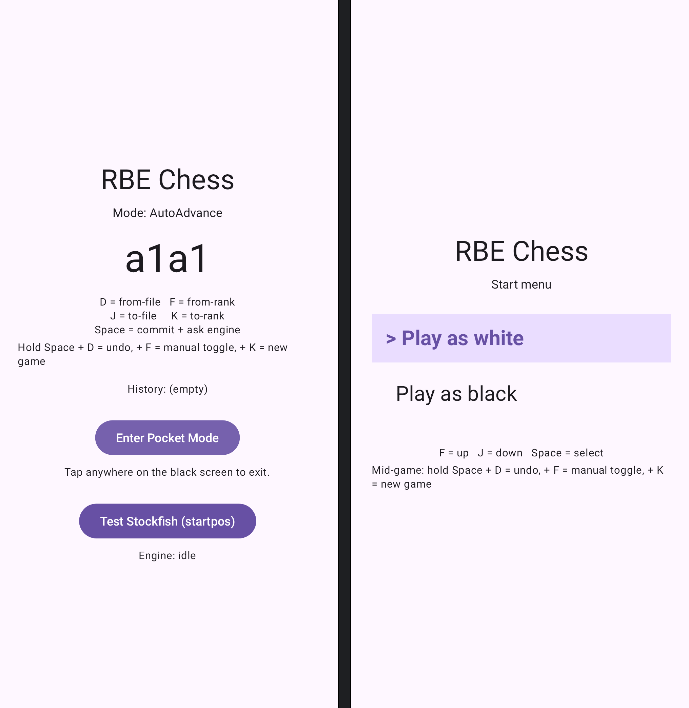
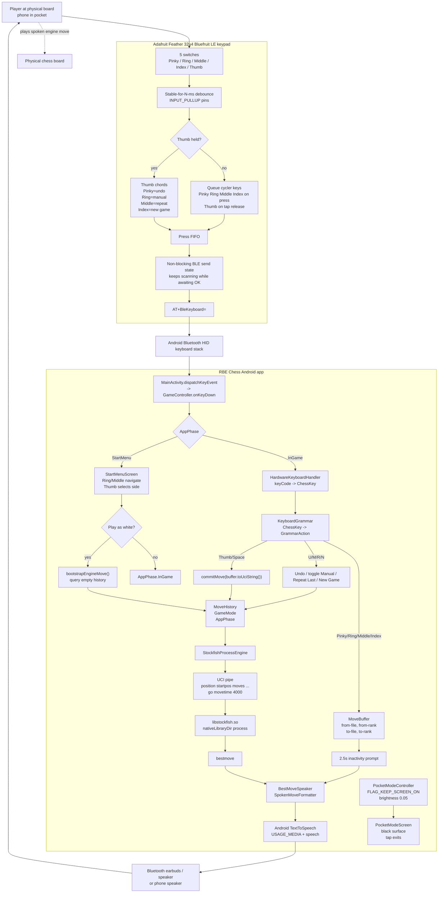
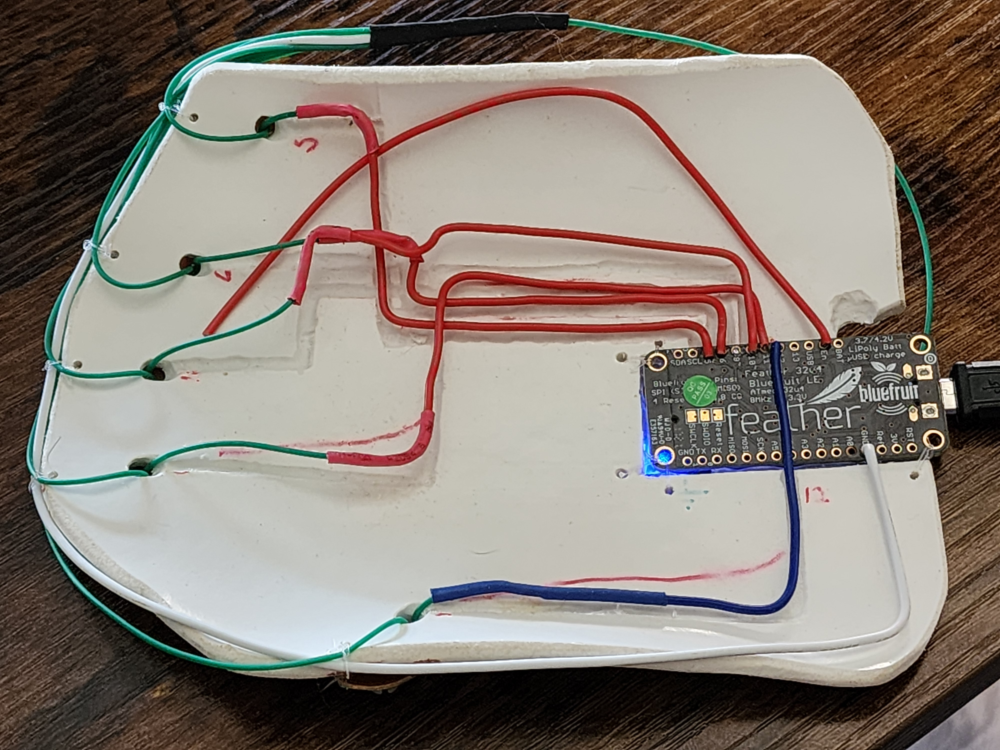
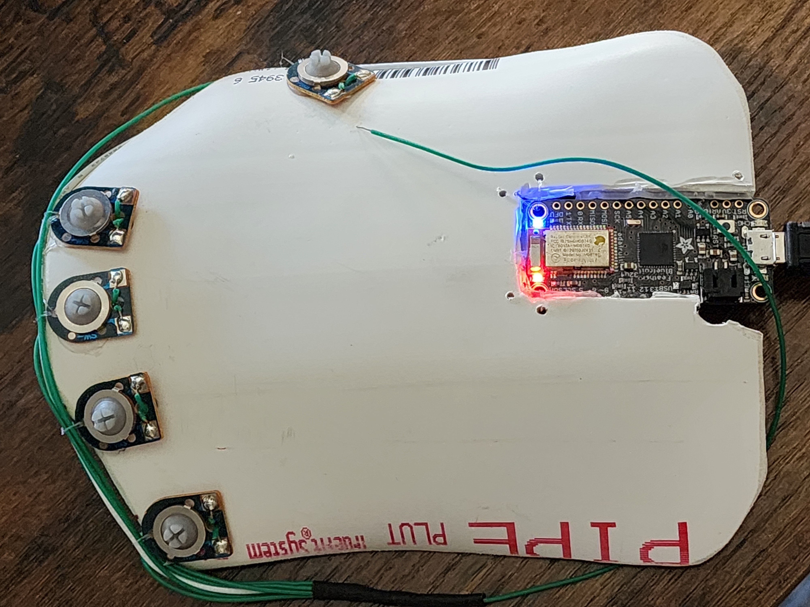

# RBE Chess

**RBE Chess** is a local-first Android chess assistant for playing at a
physical board with the phone in a pocket. A custom 5-button Bluetooth
HID keypad enters moves, the app asks bundled Stockfish for a reply, and
Android Text-to-Speech speaks the move through the current audio route.

The current build is centered on **Pocket Mode**: the Activity stays in
the foreground with a black, dim screen so Android keeps delivering
Bluetooth keyboard events. True screen-off / locked-screen input is a
later experiment, not the main path.

<p align="center">
  
</p>

## Pocket-Mode Control Flow


```mermaid
flowchart TD
    player["Player at physical board<br/>phone in pocket"] --> buttons

    subgraph feather["Adafruit Feather 32u4 Bluefruit LE keypad"]
        direction TB
        buttons["5 switches<br/>Pinky / Ring / Middle / Index / Thumb"] --> debounce["Stable-for-N-ms debounce<br/>INPUT_PULLUP pins"]
        debounce --> spaceHeld{"Thumb held?"}
        spaceHeld -- "no" --> cycler["Queue cycler keys<br/>Pinky Ring Middle Index on press<br/>Thumb on tap release"]
        spaceHeld -- "yes" --> chord["Thumb chords<br/>Pinky=undo<br/>Ring=manual<br/>Middle=repeat<br/>Index=new game"]
        cycler --> fifo["Press FIFO"]
        chord --> fifo
        fifo --> bleState["Non-blocking BLE send state<br/>keeps scanning while awaiting OK"]
        bleState --> bleCmd["AT+BleKeyboard=<chars>"]
    end

    bleCmd --> androidHid["Android Bluetooth HID keyboard stack"]
    androidHid --> dispatch["MainActivity.dispatchKeyEvent<br/>-> GameController.onKeyDown"]

    subgraph app["RBE Chess Android app"]
        direction TB
        dispatch --> phase{"AppPhase"}

        phase -- "StartMenu" --> menu["StartMenuScreen<br/>Ring/Middle navigate<br/>Thumb selects side"]
        menu --> startWhite{"Play as white?"}
        startWhite -- "yes" --> bootstrap["bootstrapEngineMove()<br/>query empty history"]
        startWhite -- "no" --> inGame["AppPhase.InGame"]

        phase -- "InGame" --> keyMap["HardwareKeyboardHandler<br/>keyCode -> ChessKey"]
        keyMap --> grammar["KeyboardGrammar<br/>ChessKey -> GrammarAction"]

        grammar -- "Pinky/Ring/Middle/Index" --> buffer["MoveBuffer<br/>from-file, from-rank<br/>to-file, to-rank"]
        buffer --> inactive["2.5s inactivity prompt"]
        inactive --> speaker

        grammar -- "Thumb/Space" --> commit["commitMove(buffer.toUciString())"]
        grammar -- "U/M/R/N" --> control["Undo / toggle Manual / Repeat Last / New Game"]
        control --> state["MoveHistory<br/>GameMode<br/>AppPhase"]
        commit --> state
        bootstrap --> state

        state --> engine["StockfishProcessEngine"]
        engine --> uci["UCI pipe<br/>position startpos moves ...<br/>go movetime 4000"]
        uci --> stockfish["libstockfish.so<br/>nativeLibraryDir process"]
        stockfish --> bestmove["bestmove <uci>"]
        bestmove --> speaker["BestMoveSpeaker<br/>SpokenMoveFormatter"]

        speaker --> tts["Android TextToSpeech<br/>USAGE_MEDIA + speech"]

        pocket["PocketModeController<br/>FLAG_KEEP_SCREEN_ON<br/>brightness 0.05"] --> pocketScreen["PocketModeScreen<br/>black surface<br/>tap exits"]
    end

    tts --> audio["Bluetooth earbuds / speaker<br/>or phone speaker"]
    audio --> player
    player -. "plays spoken engine move" .-> board["Physical chess board"]
```

## How The Loop Feels

1. Pair the keypad; Android sees it as a hardware keyboard named
   `RBE Keypad v<N>`.
2. Launch RBE Chess. The verbal start menu speaks the current option.
3. Use **Ring/Middle** to choose a side and **Thumb** to start.
4. Enter the opponent's move with the four cycler buttons.
5. Tap **Thumb**. The app says "Calculating", sends the move history to
   Stockfish, then speaks the best move.
6. In AutoAdvance mode, the spoken engine move is appended to history so
   the next keypad move is again the opponent's reply. In Manual mode,
   the engine move is only advisory and the user types every ply.

## Keypad Controls

### In Game

| Gesture                    | Firmware HID output | Android action                                |
| -------------------------- | -------------------:| --------------------------------------------- |
| **Pinky**                  | `D`                 | Cycle from-file: `a` through `h`              |
| **Ring**                   | `F`                 | Cycle from-rank: `1` through `8`              |
| **Middle**                 | `J`                 | Cycle to-file: `a` through `h`                |
| **Index**                  | `K`                 | Cycle to-rank: `1` through `8`                |
| **Thumb tap**              | `Space`             | Commit the current UCI move and ask Stockfish |
| **Hold Thumb + Pinky**     | `U`                 | Undo the last move pair and clear the buffer  |
| **Hold Thumb + Ring**      | `M`                 | Toggle Manual / AutoAdvance mode              |
| **Hold Thumb + Middle**    | `R`                 | Repeat the last replayable spoken output      |
| **Hold Thumb + Index**     | `N`                 | End the current game; finished games can start a new one |

Each coordinate starts unset and renders as `a` or `1`. The first press
selects the first value, so one Pinky press speaks `A`, two Pinky presses
speak `B`, and so on. After 2.5 seconds of no keypresses, TTS reads the
assembled move as a confirmation prompt.

### Start Menu

| Gesture                         | Action          |
| ------------------------------- | --------------- |
| **Ring**                        | Previous option |
| **Middle**                      | Next option     |
| **Thumb**                       | Select side     |
| **Hold Thumb + Middle**         | Repeat last spoken option/status |
| **Pinky / Index / other chords**| Ignored         |

## Hardware Prototype

A carved and warped piece of split pvc pipe, heat-formed to hug my thigh while resting in my pocket. buttons are pressable through jeans/pants. Battery fits into notch, no switch yet (will be wired between ground and enable)

| Bottom view                                               | Top view                                                   |
| --------------------------------------------------------- | ---------------------------------------------------------- |
|  |  |

The current keypad firmware lives in
[`firmware/RBE_32u4_chess`](firmware/RBE_32u4_chess). It targets an
**Adafruit Feather 32u4 Bluefruit LE** with five momentary switches wired
from pin to ground using internal pull-ups:

| Finger | Firmware HID | Feather pin |
| ------ | ------------ | -----------:|
| Pinky  | `D`          | 5           |
| Ring   | `F`          | 6           |
| Middle | `J`          | 10          |
| Index  | `K`          | 11          |
| Thumb  | `Space`      | 12          |

Firmware blinks `FIRMWARE_VERSION` on boot and advertises as
`RBE Keypad v<N>`, making it possible to confirm which sketch is flashed
without a USB serial session. (Current version is 8.)

Battery is sampled from the A9 voltage divider, converted to a 0-100 %
piecewise-linear Li-Po estimate, and reported as four HID keystrokes:
the literal characters `B` + three zero-padded ASCII digits (e.g.
`B025`). Firmware v8 no longer sends idle timer heartbeats; once a report
is due, the next real keypad input queues the battery packet. The app's
`BatteryReportParser` intercepts the sequence before the chess grammar
sees it, so the keystream stays clean. See the firmware README's
"Battery reporting via the HID stream" section.

## Android Architecture

`MainActivity` is a thin Android shell. All game behavior lives in the
Android-free `game/` package so it runs in plain JVM tests against a
scripted engine and a recording speech sink.

| Area          | Files                                    | Responsibility                                                              |
| ------------- | ---------------------------------------- | --------------------------------------------------------------------------- |
| App shell     | `MainActivity.kt`                        | Own TTS, Stockfish process, Pocket Mode window flags, session storage; forward keys |
| Game loop     | `game/GameController.kt`                 | Start menu, move entry, legality check, engine turns, chords, promotion, finished-game menu, battery |
| Game state    | `game/GameState.kt`, `chess/MoveHistory.kt` | Observable UI state, UCI plies, side, AutoAdvance vs Manual, session snapshot mapping |
| Autofill      | `game/AutofillCoordinator.kt`, `input/MoveAutofill.kt` | Prefill forced or clearly-best moves without clobbering newer input |
| Narrative     | `game/NarrativeTracker.kt`, `narrative/` | Repeat-last narrative tail and engine-eval tone                             |
| Input grammar | `input/`                                 | Map Android key codes to chess actions and mutate `MoveBuffer`              |
| UI            | `ui/`                                    | Compose start menu, board, normal screen, mini keypad                       |
| Pocket Mode   | `pocket/`                                | Keep the Activity awake, dim the screen, show the black long-press-to-exit surface |
| Engine        | `engine/`                                | Spawn Stockfish and speak UCI over stdin/stdout                             |
| Speech        | `speech/`                                | Convert UCI moves and status events into TTS-friendly phrases               |
| Persistence   | `session/`, `export/`                    | SharedPreferences session resume, PGN/FEN text export                       |

Stockfish is treated as a black-box process. The Android code does not
implement chess search; it sends `position startpos moves ...` and
`go movetime 4000`, then waits for `bestmove`.

## Stockfish Binary

The actual engine binary is not committed because it is about 109 MB.
After cloning, fetch it once:

```bash
scripts/fetch-stockfish.sh
```

The script places the official Stockfish `sf_18` Android ARMv8 Dot
Product build at:

```text
app/src/main/jniLibs/arm64-v8a/libstockfish.so
```

The `.so` name is an Android packaging trick: AGP extracts `lib*.so`
files into `nativeLibraryDir`, where `StockfishProcessEngine` can
execute the file directly and talk UCI to it.

## Build

Prerequisites:

- Android SDK 35
- JDK 11-compatible Android toolchain
- Gradle wrapper from this repo
- Arduino IDE or `arduino-cli` for the Feather firmware

Common app commands:

```powershell
# Run JVM unit tests
.\gradlew.bat test

# Build a debug APK
.\gradlew.bat assembleDebug

# Install on a connected Android device
.\gradlew.bat installDebug
```

Wireless debugging over Wi-Fi is supported and preferred for app
dogfooding on the S22 Ultra. Use USB mainly for initial pairing,
recovery, or firmware work. On the phone, enable **Developer options ->
Wireless debugging**, then pair/connect from the workstation:

```powershell
adb pair <phone-ip>:<pairing-port>
adb connect <phone-ip>:<debug-port>
.\gradlew.bat installDebug
```

The pairing port and debug port are usually different; Android shows
both in the Wireless debugging screen. Keep the phone and workstation on
the same trusted Wi-Fi network.

Firmware build notes and upload troubleshooting are in
[`firmware/RBE_32u4_chess/README.md`](firmware/RBE_32u4_chess/README.md).

## Current Status

The full keypad game loop (start menu, move entry, legality guard, engine
replies, chords, promotion, check/mate/stalemate, repetition/move-rule/
material draws, export, resume, battery telemetry) is implemented and has been dogfooded with firmware v8. True
screen-off capture is deferred. See [`STATUS.md`](STATUS.md) for what is
verified on-device, what needs a phone recheck, and what is next.

## Further Reading

- [`STATUS.md`](STATUS.md) - current state, verification, next steps.
- [`docs/ENGINEERING_NOTES.md`](docs/ENGINEERING_NOTES.md) - implementation decisions and the canonical keypad grammar.
- [`docs/AUTOCOMPLETE.md`](docs/AUTOCOMPLETE.md) and [`docs/NARRATIVE.md`](docs/NARRATIVE.md) - feature designs.
- [`docs/history/`](docs/history/) - original product brief, Pocket Mode addendum, milestone history.
